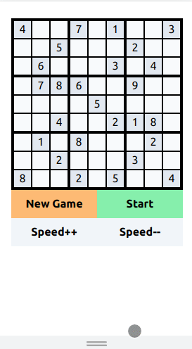

## sudokuSolver

  
  
  
  
  

#### Example

  

#### Background

An exceptionally verbose sudoku solver accompanied by a visualization made in React to give students an idea of how to approach writing the algorithm.